# Sporcu Gelişim Platformu


Sporcu Gelişim Platformu; sporcu, antrenör, ebeveyn ve admin rollerini tek bir sistemde buluşturan; profil takibi, branş yönetimi, sporcu atama, geri bildirim ve kelime havuzu süreçlerini yöneten bir Blazor Web uygulamasıdır.

Sistem özellikle sporcu gelişim sürecinde antrenör, sporcu ve veli iletişimini düzenli hale getirmek; sporcu bilgilerini merkezi olarak takip etmek ve role göre yetkili kullanıcı deneyimi sunmak için geliştirilmiştir.

---

## Projede Geliştirilen Temel Özellikler

### 1. Rol Bazlı Kullanıcı Yönetimi

Uygulamada Admin, Antrenör, Sporcu ve Ebeveyn rolleri bulunur. Her rol kendi yetkisine uygun menüleri, ekranları ve işlemleri görür.

- Admin tüm kullanıcıları yönetebilir.
- Antrenör sporcu ve ebeveyn hesabı oluşturabilir.
- Sporcu kendi profilini tamamlayabilir ve geri bildirim gönderebilir.
- Ebeveyn kendisine bağlı sporcuları takip edebilir.

### 2. Kayıt Oluşturma ve E-posta Onayı

Admin kullanıcı oluştururken rol seçimi yapabilir ve kullanıcının e-posta adresine doğrulama kodu gönderilir. Kullanıcı e-posta onayını tamamladıktan sonra sisteme giriş yapabilir.

E-posta adresi hatalı girilmişse kullanıcı, onay ekranından yeni e-posta adresi girerek tekrar doğrulama kodu isteyebilir.

### 3. Sporcu Profil Yönetimi

Sporcu hesabına giriş yapan kullanıcı kendi bilgilerini doldurabilir ve güncelleyebilir.

- Ad soyad
- TC kimlik no
- Telefon no
- 2. telefon numarası (ebeveyn no)
- Adres
- Spor branşı
- Doğum tarihi
- Profil görseli
- Sporcu notu

TC kimlik ve telefon alanları belirlenen doğrulama kurallarına göre kontrol edilir.

### 4. Sporcu, Antrenör ve Ebeveyn İlişkileri

Admin sporcuları antrenör veya ebeveyn hesaplarıyla eşleştirebilir. Antrenörler de kendi alt birimlerine sporcu ekleyebilir, çıkarabilir ve kendi sporcularını ebeveyn hesaplarıyla ilişkilendirebilir.

İlişki pasife alınsa bile geçmiş geri bildirimler ve kelime havuzu kayıtları silinmez. Aynı ilişki tekrar aktif hale geldiğinde geçmiş bilgiler korunur.

### 5. Geri Bildirim Sistemi

Sporcular antrenörlerine geri bildirim gönderebilir. Antrenör ve ebeveynler de ortak sporcu ilişkisi üzerinden birbirlerine özel geri bildirim iletebilir.

Geri bildirimler kullanıcıya göre gruplandırılır ve okunmamış mesajlar bildirim rozetiyle gösterilir.

### 6. Kelime Havuzu

Antrenörler kendi kelime havuzlarını oluşturabilir, kelime ekleyebilir, düzenleyebilir, pasife alabilir ve sporculara atayabilir.

Sporcular kendilerine atanmış kelimeleri görebilir ve yeni kelime önerisini antrenörüne istek olarak gönderebilir. Antrenör onaylarsa kelime havuzuna eklenir.

### 7. Admin Paneli

Admin panelinde kullanıcı yönetimi, branş yönetimi, sporcu atama, raporlar ve geri bildirim takip ekranları bulunur. Kullanıcılar role göre filtrelenebilir ve gerekli hesap işlemleri tek yerden yapılabilir.

---

## Teknolojik Altyapı

| Katman | Teknoloji |
| --- | --- |
| Backend | C#, ASP.NET Core Blazor Web App |
| UI | Razor Components, Bootstrap, özel CSS |
| Kimlik ve Yetki | ASP.NET Core Identity, cookie authentication |
| Veri Erişimi | Entity Framework Core |
| Veritabanı | SQL Server LocalDB |
| Doğrulama | FluentValidation |
| Loglama | Serilog |
| Test | xUnit, integration tests |
| Mimari | Modüler monolith, Domain/Application/Infrastructure/Web katmanları |

---

## Ekran Görüntüleri ve Arayüz Turu

### Giriş Sayfası

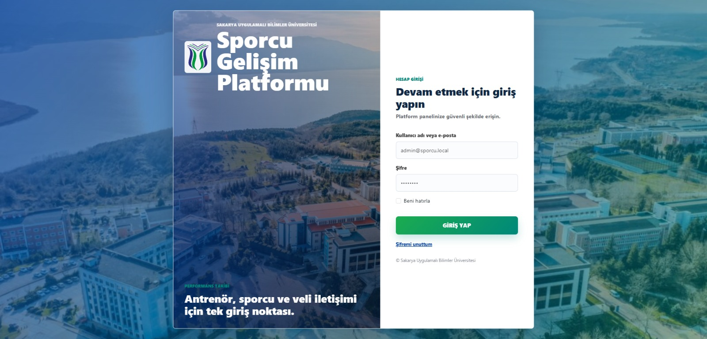

### Admin Ana Sayfa

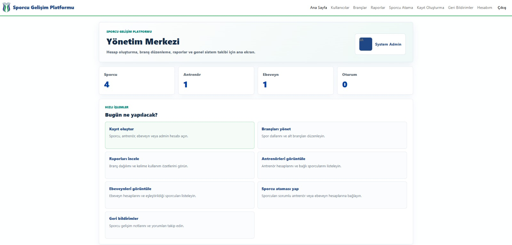

### Kullanıcı Yönetimi

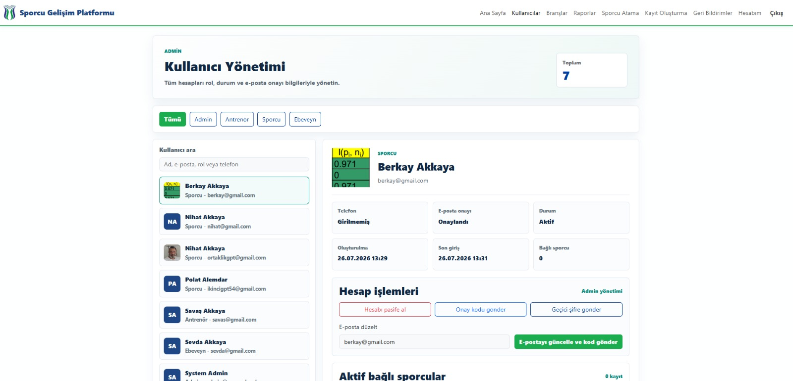

### Kayıt Oluşturma

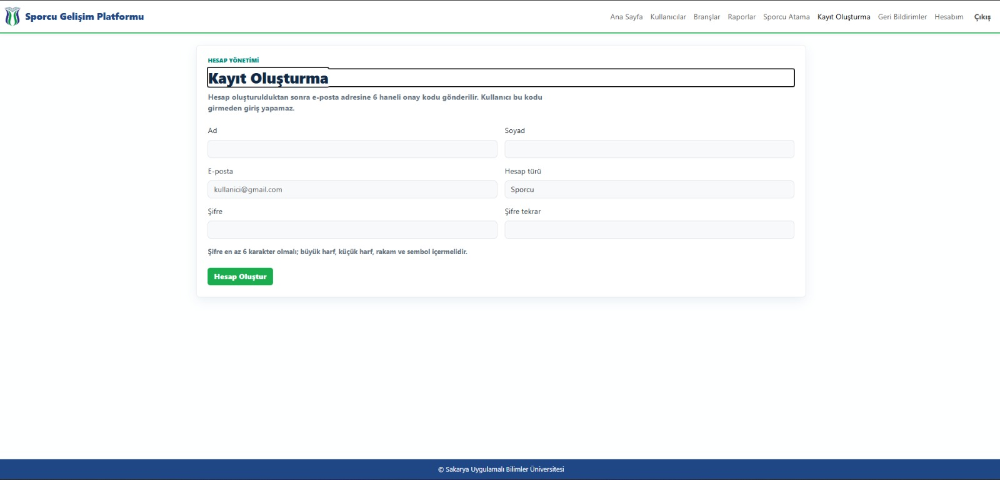

### Sporcu Atama

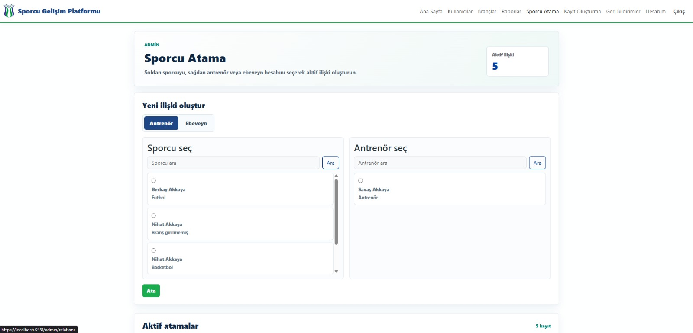

### Branş Yönetimi

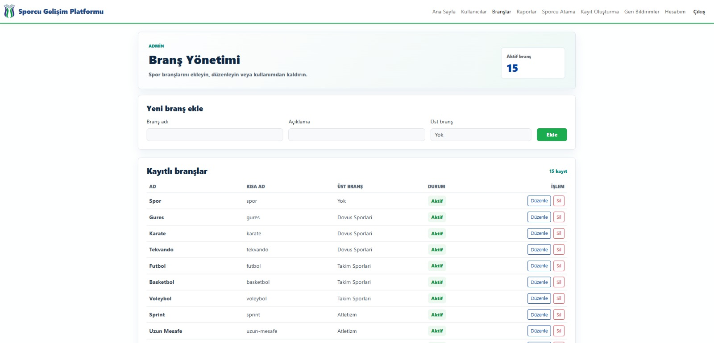

### Geri Bildirimler

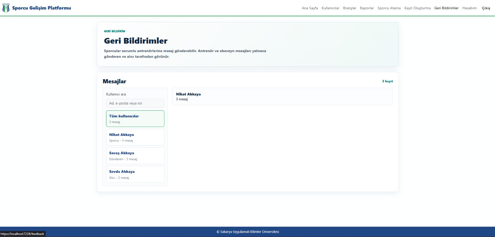

### Raporlar

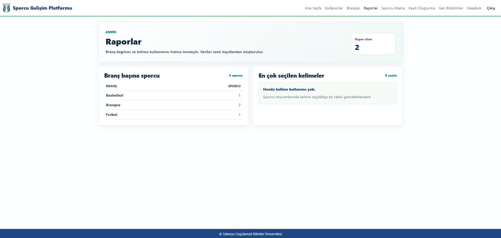

### Hesabım

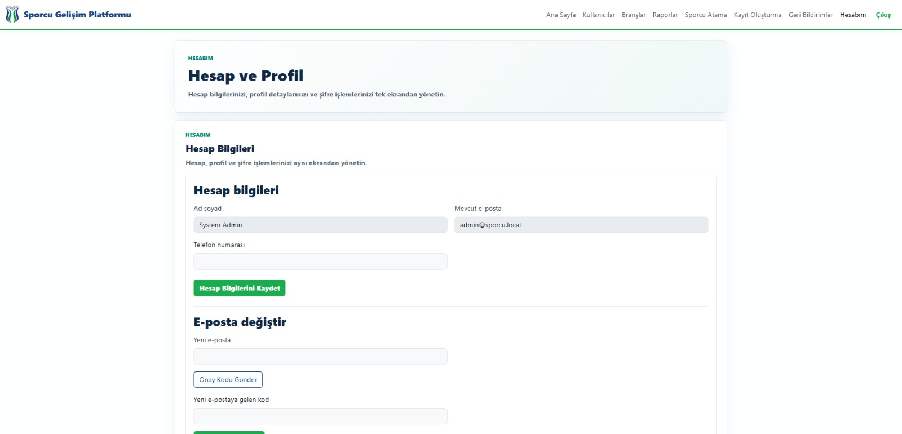

### Antrenör Kelime Havuzu

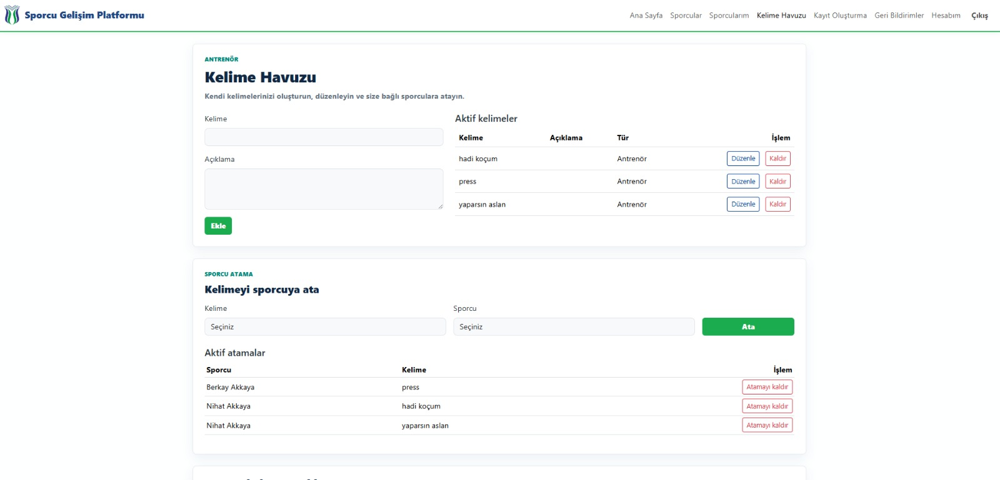

### Sporcu Kelime Havuzu

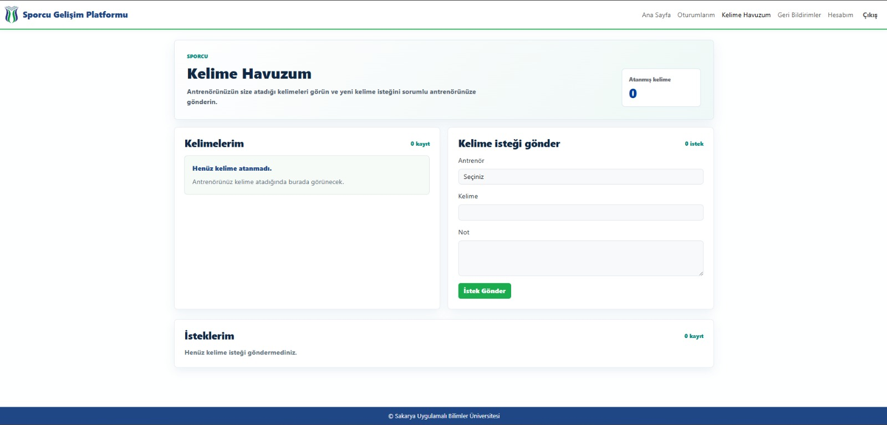

---

## Kurulum ve Çalıştırma

Projeyi çalıştırmak için .NET SDK ve SQL Server LocalDB kurulu olmalıdır.

```powershell
dotnet tool restore
dotnet restore
dotnet build
dotnet test
dotnet ef database update --project src/SporcuGelisim.Infrastructure --startup-project src/SporcuGelisim.Web
dotnet run --project src/SporcuGelisim.Web
```

Visual Studio ile çalıştırmak için `SporcuGelisimPlatformu.sln` dosyasını açıp startup project olarak `SporcuGelisim.Web` seçilebilir.

---

## Admin Seed ve Secret Yönetimi

Admin parolası ve SMTP şifresi repository içinde tutulmaz. Development ortamında user-secrets üzerinden tanımlanmalıdır.

```powershell
cd src/SporcuGelisim.Web
dotnet user-secrets set "SeedAdmin:Email" "admin@example.local"
dotnet user-secrets set "SeedAdmin:Password" "ChangeMe-12345!"
```

E-posta gönderimi için SMTP bilgileri de aynı şekilde secret store veya ortam değişkenleri üzerinden verilmelidir.

---

## Solution Yapısı

```text
src/
  SporcuGelisim.Domain
  SporcuGelisim.Application
  SporcuGelisim.Infrastructure
  SporcuGelisim.Web

tests/
  SporcuGelisim.UnitTests
  SporcuGelisim.IntegrationTests

docs/
  requirements.md
```

---

## About

Sporcu, antrenör, ebeveyn ve admin rolleri için geliştirilen; sporcu profili, branş, ilişki, geri bildirim ve kelime havuzu yönetimi sunan Blazor tabanlı sporcu gelişim takip platformu.
