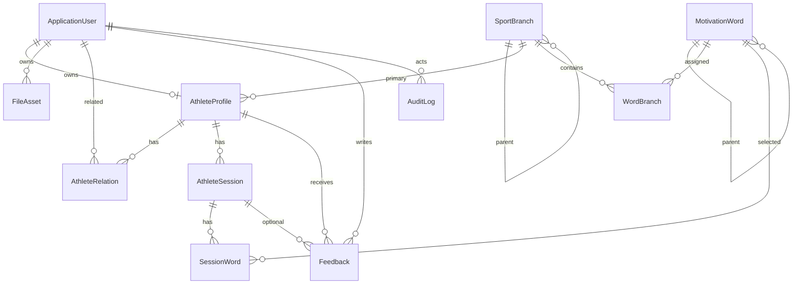

# ER Diagram

```mermaid
erDiagram
  ApplicationUser ||--o| AthleteProfile : owns
  ApplicationUser ||--o{ FileAsset : owns
  SportBranch ||--o{ SportBranch : parent
  SportBranch ||--o{ AthleteProfile : primary
  MotivationWord ||--o{ MotivationWord : parent
  MotivationWord ||--o{ WordBranch : assigned
  SportBranch ||--o{ WordBranch : contains
  AthleteProfile ||--o{ AthleteRelation : has
  ApplicationUser ||--o{ AthleteRelation : related
  AthleteProfile ||--o{ AthleteSession : has
  AthleteSession ||--o{ SessionWord : has
  MotivationWord ||--o{ SessionWord : selected
  AthleteProfile ||--o{ Feedback : receives
  AthleteSession ||--o{ Feedback : optional
  ApplicationUser ||--o{ Feedback : writes
  ApplicationUser ||--o{ AuditLog : acts
```
